# MB Contact Form 1.2.1

[Srpski](#srpski) | [English](#english)

## Srpski

## DEMO

[Isprobajte kontakt formu](https://stagento.com/kontakt) — Trenutno samo Frontend.

## Funkcionalnosti

MB Contact Form omogućava prilagođavanje kontakt forme kroz Magento administraciju, bez menjanja koda.

- Full Page Cache kompatibilan CMS widget.
- Responsive i Hyvä kompatibilan storefront bez RequireJS-a, jQuery-ja i Knockout-a.
- Konfiguracija po Default, Website i Store View nivou.
- Vidljivost forme po customer grupama, uključujući `NOT LOGGED IN`.
- Dodavanje polja, podešavanje obaveznih unosa i pravila validacije.
- Izmenjivi nazivi standardnih polja i mogućnost dodavanja `text`, `textarea` i `select` polja.
- Izmenjivi `Sender Email`, `Sender Name` i `Recipient Email`.
- Magento `Email Template` izbor za izgled email obaveštenja.
- Google reCAPTCHA v2 Checkbox i Cloudflare Turnstile sa serverskom proverom tokena.
- Prilagodljiva success poruka, success URL i newsletter URL.
- Engleski izvorni tekstovi i srpski Latinica prevodi preko `sr_Latn_RS.csv`.
- Admin konfiguracija dostupna samo Full Access administratorima.
- Mogućnost prijave na newsletter nakon slanja poruke.
- Instalacija i ažuriranje preko GitHuba i Composera.

## Kompatibilnost

- **PHP:** 8.1.x, 8.2.x, 8.3.x i 8.4.x prema zahtevima modula u `composer.json`. Izabrana PHP verzija mora odgovarati i konkretnoj Magento verziji.
- **Magento:** potvrđeno na Magento 2.4.7-p3. Composer ne ograničava Magento pakete na određenu verziju; druge verzije nisu potvrđene ovim staging testom.
- **Teme:** podrška za Hyvä i Luma; staging provera potvrđena je na Hyvä okruženju navedenom ispod.

### Testirano na staging okruženju

| Komponenta | Verzija |
| --- | --- |
| MB Contact Form | 1.0.4 |
| PHP | 8.3.33 |
| Magento | 2.4.7-p3 |
| Hyvä Theme Module | 1.5.2 |

## Podešavanje

Konfiguracija se nalazi na:

```text
Stores > Configuration > MB Contact Form > Contact Form
```

Tu se podešavaju:

1. status modula i dozvoljene customer grupe;
2. naslov forme i nazivi polja;
3. email pošiljaoca, primaoca i Magento Email Template;
4. dodatna polja i njihova validacija;
5. Google reCAPTCHA ili Cloudflare Turnstile ključevi;
6. success poruka, success URL i newsletter podešavanja.

## CMS Widget

Widget se može dodati kroz Page Builder / Insert Widget ili direktno u sadržaj CMS stranice ili bloka:

```text
{{widget type="MB\ContactForm\Block\Widget\Form"}}
```

## Validacija

Pravila ispod su početna pravila; za opciona standardna polja mogu se promeniti u tabeli.

- Poruka: latinična i ćirilična slova, ASCII brojevi, razmaci, novi redovi i interpunkcija.
- Ime i prezime: latinična i ćirilična slova i razmaci.
- Email: stroga browser i serverska email validacija.
- Kompanija: latinična i ćirilična slova, ASCII brojevi i razmaci.
- Telefon: samo ASCII brojevi.
- Kinesko, tajlandsko, hebrejsko, arapsko, grčko i druga nepodržana pisma se odbijaju u poljima ograničenim na slova.

Ista pravila se primenjuju u browseru i ponovo na serveru.

## Cache i bezbednost

- Widget ostaje cacheable i poštuje Magento customer-group HTTP context.
- Success stranica je namerno `cacheable="false"` jer jednokratno čita poslati email iz sesije.
- POST endpoint proverava form key, status modula, customer grupu, sva polja i CAPTCHA token.
- Korisnički podaci se escape-uju u PHTML i email template-u.
- CSP pravila dozvoljavaju CAPTCHA hostove, dok se newsletter `form-action` origin dodaje dinamički samo na success stranici.
- Success stranica koristi `NOINDEX,FOLLOW`.

## Snimci ekrana

Prikazi sa staging okruženja.

### Kontakt forma na Hyvä temi

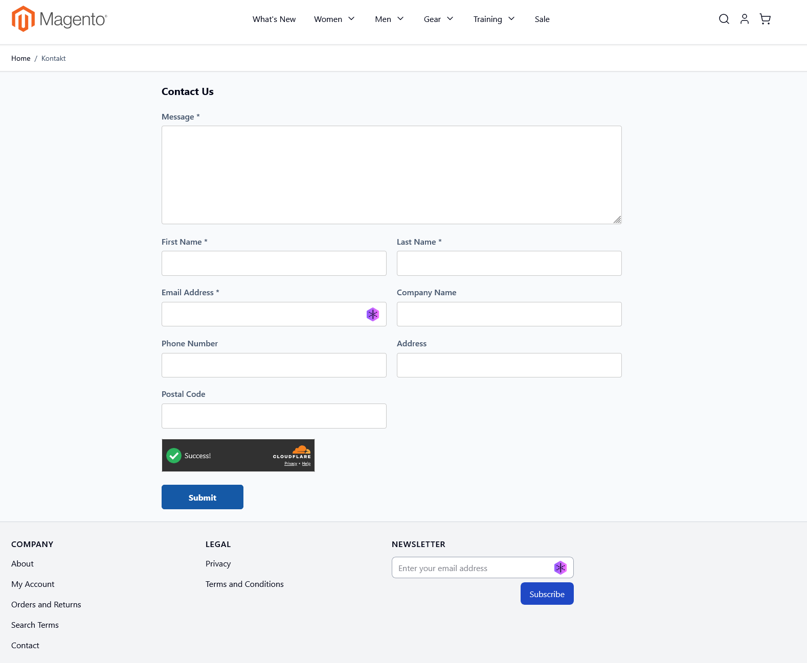

### Mobilni prikaz — naslov i polja forme

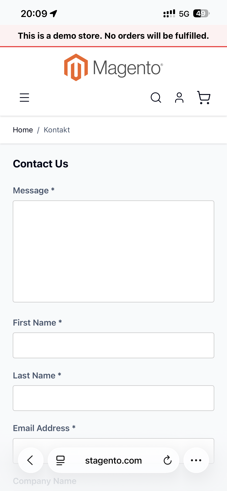

### Mobilni prikaz — dodatna polja, Turnstile i Submit

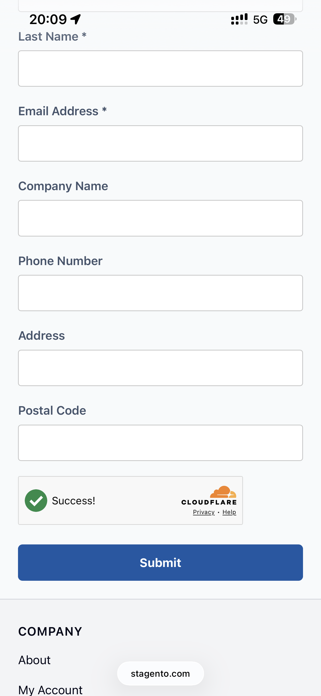

### Popunjena forma sa dodatnim poljima i Turnstile zaštitom

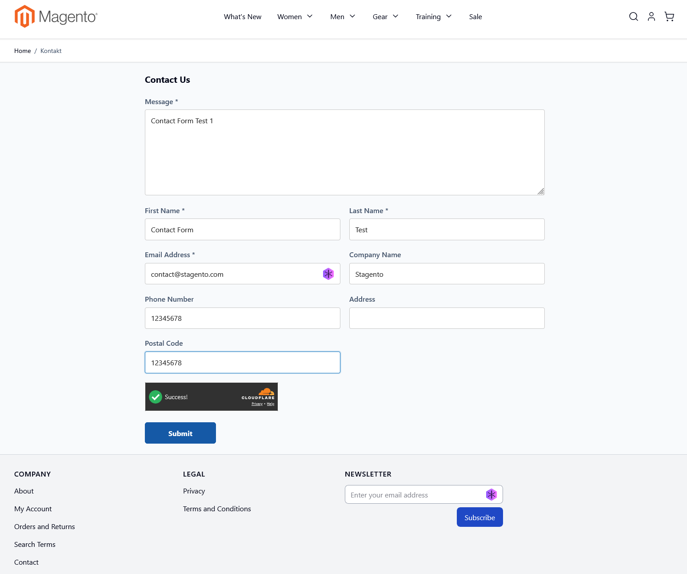

### Validacija imena i prezimena

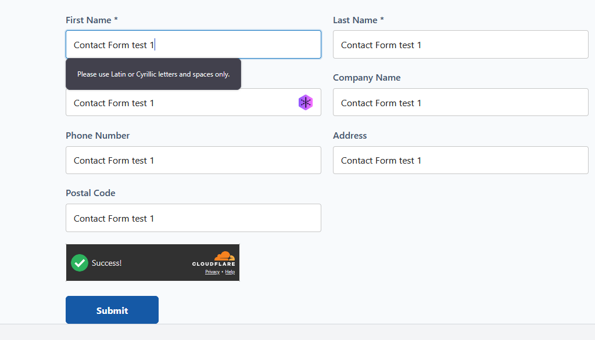

### Validacija email adrese

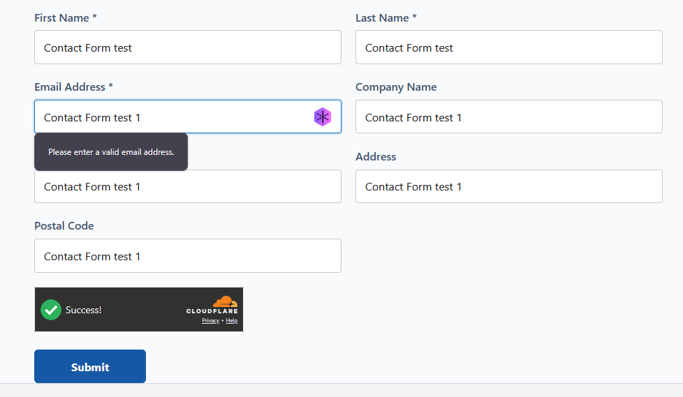

### Potvrda slanja i newsletter prijava

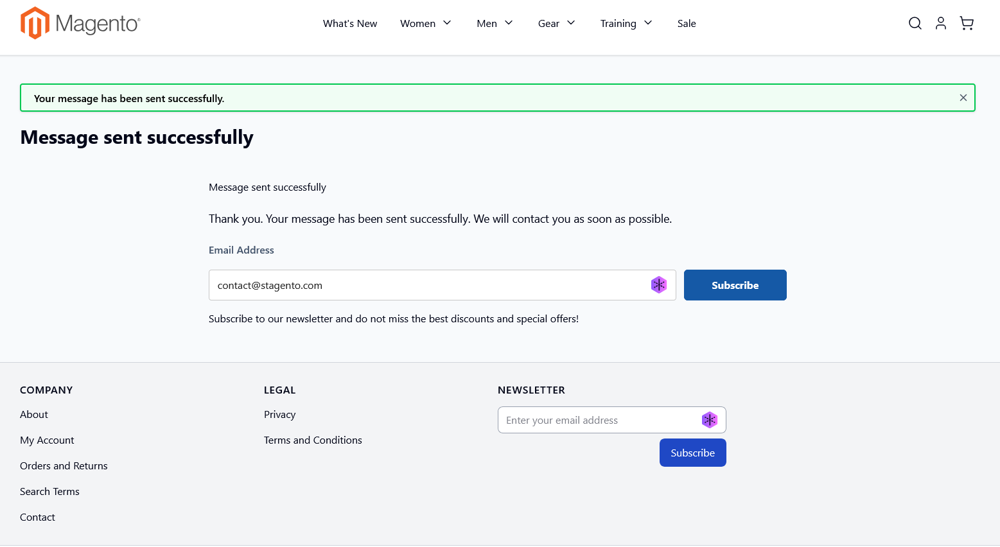

### Email obaveštenje sa porukom i dodatnim poljima

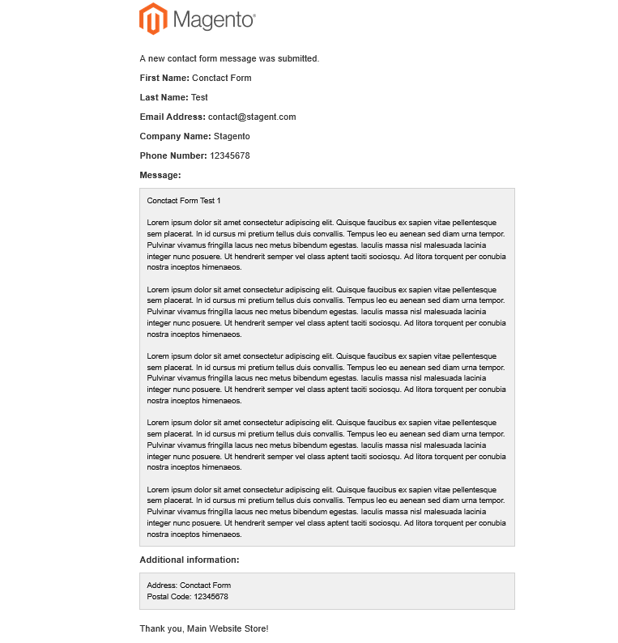

### Admin podešavanja, dodatna polja i CAPTCHA

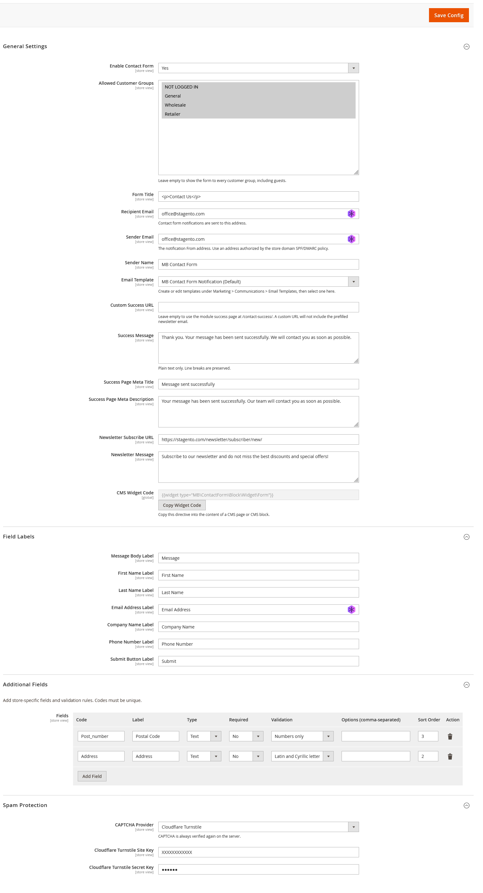

### Zaštita od spama

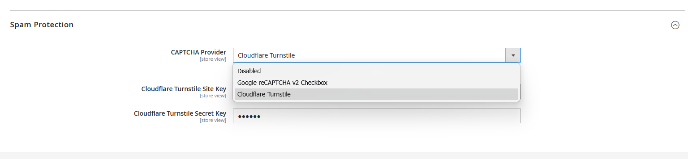

### CMS widget kod


### Field Labels

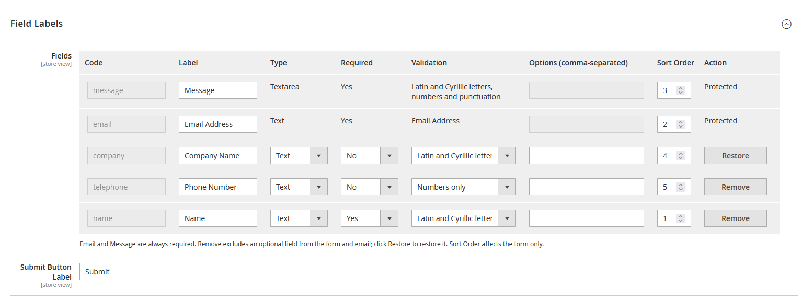

### Email zaglavlja i Mailpit HTML compatibility provera

Screenshot prikazuje `From`, `To` i `Reply-To` zaglavlja koja dobijaju email klijenti, kao i Mailpit `HTML Check` rezultat kompatibilnosti ugrađenog email šablona.

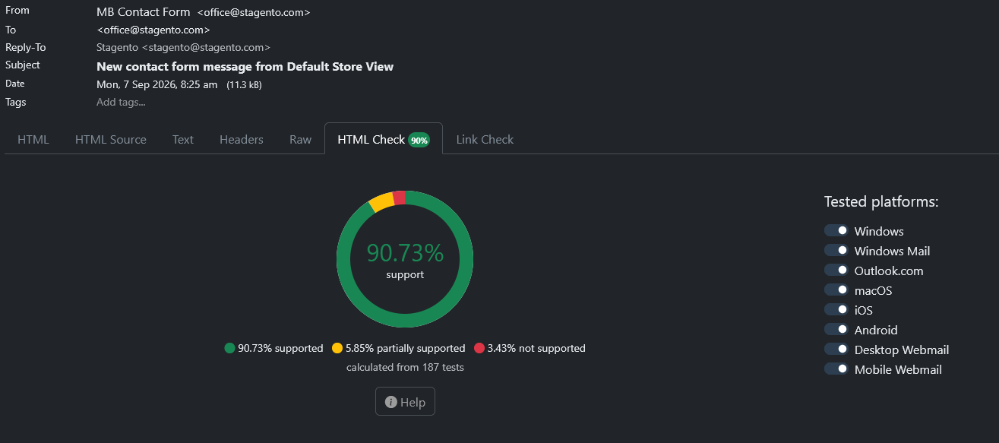

## Instalacija

### Composer (GitHub)

Za privatni repozitorijum prethodno podesiti Composer GitHub autentifikaciju.
Iz Magento root foldera pokrenuti:

```bash
composer config repositories.mb-contact-form vcs https://github.com/marvikonvic/MB_ContactForm.git
composer require mb/module-contact-form:1.2.1 --prefer-dist
```

Composer automatski registruje modul iz paketa u `vendor` direktorijumu.
Ne instalirati istovremeno i kopiju u `app/code`. Nakon instalacije pokrenuti
Magento komande za aktivaciju navedene ispod.

### ZIP

Raspakovati modul tako da se nalazi u:

```text
app/code/MB/ContactForm
```

Zatim iz Magento root foldera pokrenuti:

```bash
bin/magento module:enable MB_ContactForm
bin/magento setup:upgrade
bin/magento setup:di:compile
bin/magento cache:clean
```

U Production modu generisati static content za aktivne locale i teme:

```bash
bin/magento setup:static-content:deploy -f en_US sr_Latn_RS
```

## Dokumentacija

Kompletna tehnička dokumentacija i staging kontrolna lista nalaze se u [README fajlu modula](app/code/MB/ContactForm/README.md).

## Licenca

Modul se distribuira pod vlasničkom [MB trajnom licencom za modul](LICENSE.md). Licenca dozvoljava trajno korišćenje na neograničenom broju Magento instalacija i domena koji su u vlasništvu ili pod neposrednom kontrolom istog korisnika licence.

Modul trenutno nije u komercijalnoj prodaji; privatna distribucija zahteva izričito odobrenje davaoca licence. Puni uslovi na engleskom i srpskom nalaze se u licencnom fajlu.

## Istorija verzija

### Novo u verziji 1.2.1

Remove checkbox je zamenjen dugmetom **Remove / Restore**. Klik menja stanje polja; **Save Config** čuva promenu. Email i Message ostaju zaštićeni.

### Novo u verziji 1.2.0

- First Name i Last Name zamenjeni su jednim poljem **Name** (`name`), početno obaveznim, sa validacijom latiničnih i ćiriličnih slova i razmaka. Može se ukloniti i promeniti Required.
- Postojeći redovi za ime/prezime se pri čitanju konfiguracije zamenjuju novim Name redom, na ranijoj od dve pozicije. Novi Name je uključen i obavezan čak i ako je staro polje bilo uklonjeno. Ostala podešavanja ostaju sačuvana. Čuvanje tabele upisuje novi format samo u izabrani scope.
- Email redosled: **Name → Email Address → Company Name → Phone Number → Message → Additional information**. Reply-To naziv koristi Name.
- Ako koristite kopirani email šablon, zamenite stare firstname/lastname promenljive sa `name`, `label_name` i uslovom `show_name`, ili izaberite ugrađeni šablon.
- Verzija 1.2.0 je proverena lokalno; slanje emaila i Admin prikaz ove verzije još treba proveriti na stagingu.

### Istorijski pregled verzije 1.1.0

- **Field Labels → Fields** je tabela: Code, Label, Type, Required, Validation, Options (comma-separated), Sort Order i Action.
- Standardni kodovi su fiksni: `message`, `firstname`, `lastname`, `email`, `company`, `telephone`.
- **Email i Message** ostaju uključeni i obavezni. Required je zaključan na Yes; tip i validacija su zaštićeni. Njihovi nazivi i Sort Order mogu se menjati.
- **Action → Remove** isključuje opciono polje iz forme i emaila. Poništavanje izbora vraća polje bez gubitka podešavanja.
- Sort Order menja redosled standardnih polja na formi. Additional Fields ostaju zasebna tabela i prikazuju se zatim prema svom Sort Order-u.
- Email uvek koristi redosled: First Name, Last Name, Email Address, Company Name, Phone Number, Message, Additional information. Uklonjena polja se izostavljaju.
- **Submit Button Label** ostaje zasebno podesiv po Store View-u; CTA stil ostaje isti.
- Admin prevodi prate jezik administratora: engleski izvorni tekst i srpska latinica (`sr_Latn_RS`). Ručno uneti nazivi standardnih polja čuvaju se po Store View-u.
- Ako nova tabela još nije sačuvana, postojeći nazivi iz verzije 1.0.4 koriste se automatski, uz isti početni raspored i obaveznost. Nema prepisivanja postojećih scope vrednosti.

**Provera:** verzija 1.1.0 je proverena lokalnim testovima pravila i PHP/PHTML/XML proverama. Staging tabela i screenshotovi ispod odnose se na ranije potvrđenu verziju 1.0.4; nova verzija još zahteva Magento runtime proveru.

**Email šabloni:** ugrađeni šablon poštuje uklonjena polja. Ako je izabran ranije kopiran šablon iz Marketing → Email Templates, ažurirajte ga novim uslovima `show_firstname`, `show_lastname`, `show_company`, `show_telephone` ili izaberite ugrađeni šablon.

Magento 2 kontakt forma kompatibilna sa Luma i Hyvä temama. Modul pruža cache-friendly CMS widget, Store View konfiguraciju, prilagodljiva polja, Magento Email Templates i izbor između Google reCAPTCHA v2 i Cloudflare Turnstile zaštite.

- **1.1.0:** Tabela standardnih polja, zaštićeni Email/Message, dinamička validacija, fiksan email redosled i dopunjeni Admin prevodi.

- **1.0.4:** Dodaje 24 px razmaka iznad i ispod forme i potvrde, kao i CTA stil Subscribe dugmeta.
- **1.0.3:** Postavlja naslov forme na 20 px i bold (700).
- **1.0.2:** Proširuje Additional Fields tabelu i dodaje CTA stil Submit dugmetu.
- **1.0.1:** Ispravlja identifikator Admin taba za Magento XML validaciju.

---

## English

## Demo

[Try the contact form](https://stagento.com/kontakt) — Currently frontend only.

## Features

MB Contact Form lets you customize the contact form through Magento Admin without changing code.

- Full Page Cache compatible CMS widget.
- Responsive, Hyvä-compatible storefront without RequireJS, jQuery, or Knockout.
- Configuration at Default, Website, and Store View scope.
- Form visibility by customer group, including `NOT LOGGED IN`.
- Additional fields, required inputs, and validation rules.
- Customizable standard field labels and support for `text`, `textarea`, and `select` fields.
- Configurable `Sender Email`, `Sender Name`, and `Recipient Email`.
- Magento `Email Template` selection for notification emails.
- Google reCAPTCHA v2 Checkbox and Cloudflare Turnstile with server-side token verification.
- Custom success message, success URL, and newsletter URL.
- English source text and Serbian Latin translations through `sr_Latn_RS.csv`.
- Admin configuration restricted to Full Access administrators.
- Newsletter subscription option after sending a message.
- Installation and updates through GitHub and Composer.

## Compatibility

- **PHP:** 8.1.x, 8.2.x, 8.3.x, and 8.4.x according to the module's `composer.json` requirements. The selected PHP version must also be supported by the installed Magento version.
- **Magento:** verified on Magento 2.4.7-p3. Composer does not restrict Magento packages to a specific version; other versions have not been confirmed by this staging test.
- **Themes:** Hyvä and Luma support; staging verification was performed on the Hyvä environment below.

### Tested staging environment

| Component | Version |
| --- | --- |
| MB Contact Form | 1.0.4 |
| PHP | 8.3.33 |
| Magento | 2.4.7-p3 |
| Hyvä Theme Module | 1.5.2 |

## Configuration

Configuration is available under:

```text
Stores > Configuration > MB Contact Form > Contact Form
```

Available settings include:

1. Module status and allowed customer groups.
2. Form title and field labels.
3. Sender, recipient, and Magento Email Template.
4. Additional fields and their validation.
5. Google reCAPTCHA or Cloudflare Turnstile keys.
6. Success message, success URL, and newsletter settings.

## CMS Widget usage

Add the widget through Page Builder / Insert Widget or directly to a CMS page or block:

```text
{{widget type="MB\ContactForm\Block\Widget\Form"}}
```

## Validation

The rules below are defaults; optional standard fields can use different rules selected in the table.

- Message: Latin and Cyrillic letters, ASCII digits, spaces, line breaks, and punctuation.
- First and last name: Latin and Cyrillic letters and spaces.
- Email: strict browser and server-side email validation.
- Company: Latin and Cyrillic letters, ASCII digits, and spaces.
- Phone: ASCII digits only.
- Chinese, Thai, Hebrew, Arabic, Greek, and other unsupported scripts are rejected in fields restricted to supported letters.

The same rules are applied in the browser and again on the server.

## Cache and security

- The widget remains cacheable and respects Magento's customer-group HTTP context.
- The success page intentionally uses `cacheable="false"` because it reads the submitted email from the session once.
- The POST endpoint checks the form key, module status, customer group, all fields, and CAPTCHA token.
- User data is escaped in PHTML and email templates.
- CSP rules allow CAPTCHA hosts; the newsletter `form-action` origin is added dynamically only on the success page.
- The success page uses `NOINDEX,FOLLOW`.

## Screenshots

Screenshots from the staging environment.

### Contact form on Hyvä


### Mobile view — title and form fields


### Mobile view — additional fields, Turnstile, and Submit


### Completed form with additional fields and Turnstile protection


### First and last name validation


### Email address validation


### Submission confirmation and newsletter subscription


### Email notification with the message and additional fields


### Admin settings, additional fields, and CAPTCHA


### Spam protection


### CMS widget code


### Field Labels


### Email headers and Mailpit HTML compatibility check

The screenshot shows the `From`, `To`, and `Reply-To` headers delivered to email clients, together with the Mailpit `HTML Check` compatibility result for the built-in email template.


## Installation

### Composer installation (GitHub)

Configure Composer GitHub authentication for the private repository first.
Run from the Magento root directory:

```bash
composer config repositories.mb-contact-form vcs https://github.com/marvikonvic/MB_ContactForm.git
composer require mb/module-contact-form:1.2.1 --prefer-dist
```

Composer automatically registers the module from its package in `vendor`.
Do not also install a copy in `app/code`. After installation, run the Magento activation commands below.

### ZIP installation

Extract the module into:

```text
app/code/MB/ContactForm
```

Then run from the Magento root directory:

```bash
bin/magento module:enable MB_ContactForm
bin/magento setup:upgrade
bin/magento setup:di:compile
bin/magento cache:clean
```

In Production mode, deploy static content for the active locales and themes:

```bash
bin/magento setup:static-content:deploy -f en_US sr_Latn_RS
```

## Documentation

Full technical documentation and the staging checklist are available in the [module README](app/code/MB/ContactForm/README.md).

## License

The module is distributed under the proprietary [MB Perpetual Module License](LICENSE.md). The license permits perpetual use on an unlimited number of Magento installations and domains owned or directly controlled by the same licensee.

The module is not currently offered for commercial sale; private distribution requires the licensor's express authorization. Full English and Serbian terms are available in the license file.

## Version history

### New in version 1.2.1

The Remove checkbox is replaced by a **Remove / Restore** button. Clicking toggles the field state; **Save Config** saves the change. Email and Message remain protected.

### New in version 1.2.0

- First Name and Last Name are replaced by **Name** (`name`), required by default, allowing Latin/Cyrillic letters and spaces. It can be removed or made optional.
- Legacy name rows are replaced when configuration is read, retaining the earlier sort position. The new Name is enabled and required even if a legacy field was removed. Other settings are preserved. Saving the table persists the new format only in the selected scope.
- Email order: **Name → Email Address → Company Name → Phone Number → Message → Additional information**. Reply-To uses Name.
- For copied email templates, replace firstname/lastname variables with `name`, `label_name`, and the `show_name` condition, or select the built-in template.
- Version 1.2.0 has local verification; email delivery and Admin rendering still require staging verification.

### Historical notes for version 1.1.0

- **Field Labels → Fields** is a table with Code, Label, Type, Required, Validation, Options (comma-separated), Sort Order, and Action.
- Standard codes are fixed: `message`, `firstname`, `lastname`, `email`, `company`, `telephone`.
- **Email and Message** remain enabled and required. Required is locked to Yes; type and validation are protected. Their labels and Sort Order can be changed.
- **Action → Remove** excludes an optional field from the form and email. Clearing the checkbox restores it without losing its settings.
- Sort Order changes the standard field order on the form. Additional Fields remain a separate table and follow in their own Sort Order.
- Email always uses this order: First Name, Last Name, Email Address, Company Name, Phone Number, Message, Additional information. Removed fields are omitted.
- **Submit Button Label** remains separately configurable per Store View; CTA styling is retained.
- Admin translations follow the administrator's interface locale: English source text and Serbian Latin (`sr_Latn_RS`). Manually entered standard field labels are stored per Store View.
- Until the new table is saved, existing 1.0.4 labels are used automatically with the original default order and required flags. Existing scope values are not overwritten.

**Verification:** version 1.1.0 has local contract tests and PHP/PHTML/XML checks. The staging table and screenshots below describe the previously verified 1.0.4 release; the new version still requires Magento runtime verification.

**Email templates:** the built-in template respects removed fields. If an older copied template is selected under Marketing → Email Templates, update it with the new `show_firstname`, `show_lastname`, `show_company`, and `show_telephone` conditions, or select the built-in template.

Magento 2 contact form compatible with Luma and Hyvä themes. The module provides a cache-friendly CMS widget, Store View configuration, customizable fields, Magento Email Templates, and a choice between Google reCAPTCHA v2 and Cloudflare Turnstile protection.

- **1.1.0:** Standard field table, protected Email/Message, dynamic validation, fixed email order, and expanded Admin translations.

- **1.0.4:** Adds 24 px of spacing above and below the form and confirmation content, plus CTA styling for the Subscribe button.
- **1.0.3:** Sets the form title to 20 px and bold (700).
- **1.0.2:** Widens the Additional Fields table and adds CTA styling to the Submit button.
- **1.0.1:** Fixes the Admin tab identifier for Magento XML validation.
